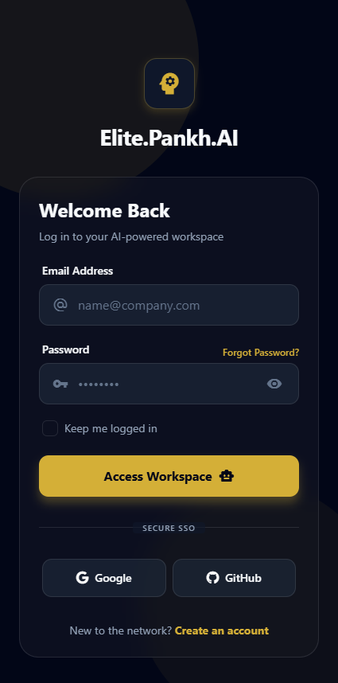
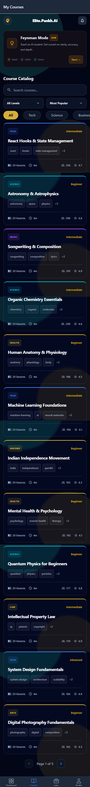
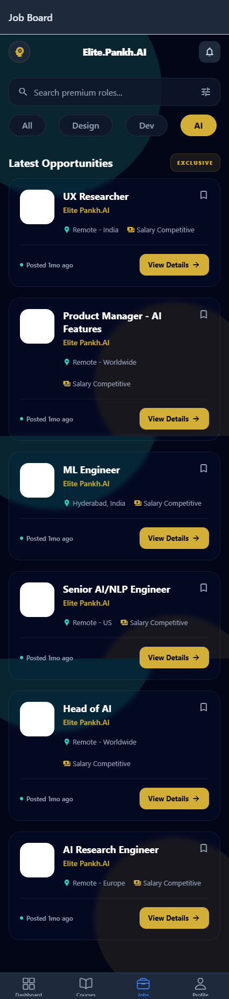
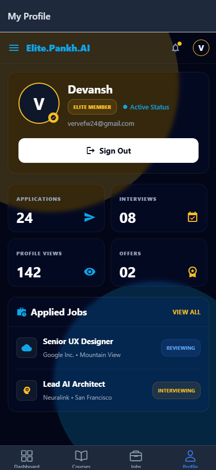
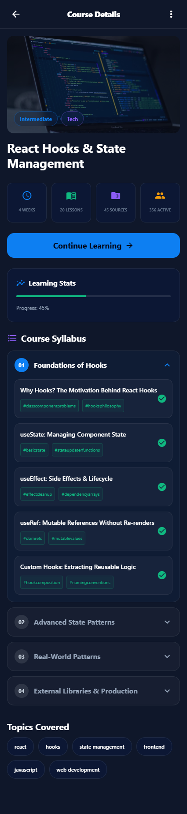
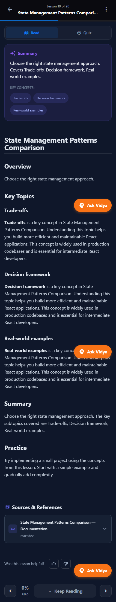
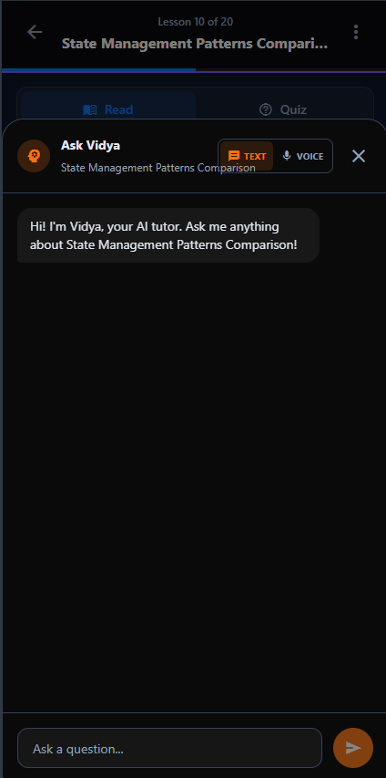
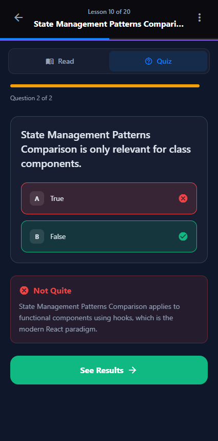
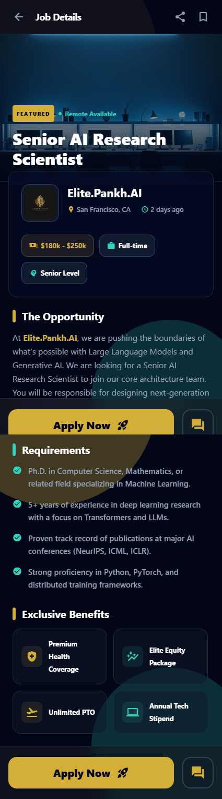
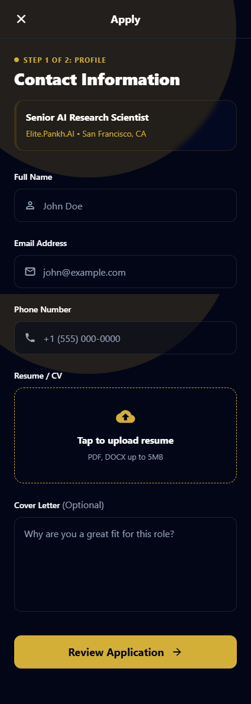

# Elite - AI-Powered Learning Platform (Android App)

A collection of screenshots showcasing the mobile interface and core features of the Elite Android application. Elite is a comprehensive AI-powered learning platform designed to deliver an interactive educational and career-building experience on mobile devices.

The images below provide a visual tour of the app's user interface and main features.

---

## App Screenshots

### 1. Login
The authentication screen for users to access their Elite account.

  

### 2. Courses
The main dashboard where students can browse and discover available courses.

  

### 3. Jobs
The integrated job portal listing career opportunities for students.

  

### 4. Profile
The user's personal profile page, tracking their learning progress and details.

  

### 5. Course Details
A comprehensive overview of a specific course, including its syllabus and objectives.

  

### 6. Course Lesson
The mobile learning interface where students consume video and text-based course content.

  

### 7. Vidya AI
The interface for interacting with the platform's dedicated AI learning assistant on mobile.

  

### 8. Quiz
The mobile assessment interface for testing knowledge retention after a lesson.

  

### 9. Job Detail
A deep dive into a specific job posting, including requirements and company information.

  

### 10. Apply to Job
The application submission screen for a selected job opportunity.

  

